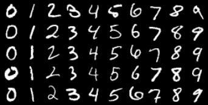
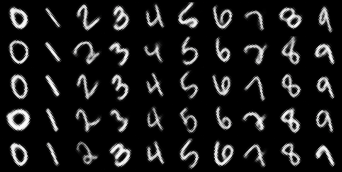
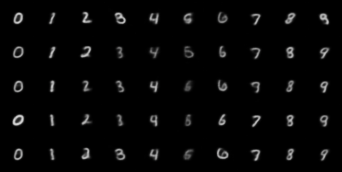

# vdat-pyro

Welcome to `vdat-pyro`! This is the repository hosting the PyTorch implementation of our **generative approach to unsupervised domain adaptation (UDA)** and its experiments.

We name our approach **variational domain adapatation/translation (VDAT)**, since it is based on variational inference and can do both domain adaptation and translation!

*Keywords: domain adaptation, domain translation, generative modeling, variational inference, latent variable model*.

#### Features
* Adapt a classifier model onto out-of-distribution data using unlabeled examples!
* Translate input examples from one data domain to look alike the other!


## Results
<table>
<caption><strong>Table 1:</strong> Performance comparison of our vs. other UDA approaches. Each cell denotes <strong>source accuracy/target accuracy</strong> on test dataset.</caption>
<thead>
<tr>
    <th>Method</th>
    <th>M→U</th>
    <th>M→M-s</th>
    <th>M→M-r</th>
    <th>S→M</th>
</tr>
</thead>
<tbody>
<tr>
    <td>Src-Only</td>
    <td>96.09% / 73.96%</td>
    <td>99.15% / 67.85%</td>
    <td>99.29% / 58.22%</td>
    <td>94.07% / 64.65%</td>
</tr>
<tr>
    <td>Joint</td>
    <td>95.47% / 95.21%</td>
    <td>99.10% / 99.03%</td>
    <td>99.07% / 98.76%</td>
    <td>93.37% / 98.96%</td>
</tr>
<tr>
    <td>Re-weight</td>
    <td>98.11% / 77.67%</td>
    <td>99.21% / 70.78%</td>
    <td>99.39% / 58.93%</td>
    <td>95.91% / 71.72%</td>
</tr>
<tr>
    <td>CORAL</td>
    <td>98.76% / 87.04%</td>
    <td>99.42% / 87.83%</td>
    <td>99.37% / 74.55%</td>
    <td>96.40% / 68.78%</td>
</tr>
<tr>
    <td>DANN</td>
    <td>98.70% / 90.10%</td>
    <td>99.90% / 88.65%</td>
    <td>99.04% / 74.28%</td>
    <td>96.57% / 74.98%</td>
</tr>
<tr>
    <td><strong>Ours</strong></td>
    <td>97.53% / <strong>95.72%</strong></td>
    <td>98.85% / <strong>92.07%</strong></td>
    <td>98.90% / <strong>93.04%</strong></td>
    <td>DNC</td>
</tr>
</tbody>
</table>

**Figure 1:** Results for domain translation using MNIST-style digits as the source domain and some other datasets as target domains.
<table style="width:100%; table-layout: fixed; text-align: center;">
  <tr>
    <td><br><em>Figure 1a: Samples from MNIST.</em></td>
    <td><br><em>Figure 1b: MNIST→USPS.</em></td>
  </tr>
  <tr>
    <td><br><em>Figure 1c: MNIST→MNIST-r.</em></td>
    <td><br><em>Figure 1d: MNIST→MNIST-s.</em></td>
  </tr>
</table>

Result for each domain translation scheme is obtained using the framework trained on the corresponding domain adaptation scenario. The input samples are from the MNIST dataset. Samples in the other domains are generated by our framework.


## Getting Started

### 1. Prerequisites
Run the below command to install all the required Python dependencies:
```bash
pip install -r requirements.txt
```

### 2. Running experiments
To run an experiment, use [`run.py`](./run.py) with the following arguments:
1. `model`: The model to run the experiment with. Currently available options are:
    * `main`: The VDAT model in our approach.
    * `rew1`, `rew2`: [Learning and Evaluating Classifiers under Sample Selection Bias](https://dl.acm.org/doi/10.1145/1015330).
    * `coral`: [Deep CORAL: Correlation Alignment for Deep Domain Adaptation](https://arxiv.org/abs/1607.01719).
    * `grad_rev`:[Unsupervised Domain Adaptation by Backpropagation](https://arxiv.org/abs/1409.7495).
    * `src_only`: Classifier model trained solely on the source dataset.
    * `joint`: Classifier model trained jointly on the source dataset and the *labeled* target dataset.

2. `--config`: The yaml config file for the experiment. The format of this file varies depending on the model to experiment with. [`./hparams/mnist2usps`](./hparams/mnist2usps.yml) is an example config for VDAT. Examples for other approaches can be found in [`./bench_model/hparams`](./bench_model/hparams).  

Here's an example command that runs our VDAT model using the specified config:
```bash
python run.py main --config ./hparams/mnist2usps.yml
```

Here's another example that runs `grad_rev`:
```bash
python run.py grad_rev --config ./bench_model/hparams/grad-rev.yml
```

### 3. Logging experiments
Results of all experiments are logged and saved to [`./runs`](./runs) using Tensorboard. To get a live view of the results while running the experiment, start Tensorboard by
```bash
python -m tensorboard.main --logdir ./runs
```
Then go to the printed link in your brower.
